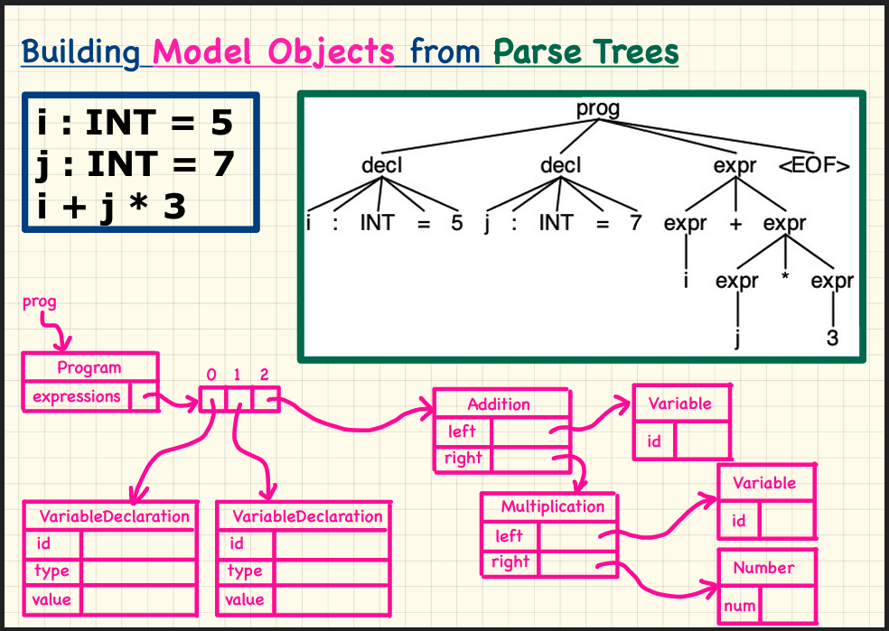

# Antlr 4

## Usage

```shell
❯ java -jar build/libs/AntlrProject-all-1.0-SNAPSHOT.jar  testCases/test3.txt
Main Class of Antlr.libs/AntlrProject-all-1.0-SNAPSHOT.jar  testCases/test3.txt
i is 5
j is 7
i + j is 12
i + j * 3 is 26
i + j + 3 is 15
10 is 10

```

## Install Antlr

1. Download Antlr-4.12.0 jar file from [antlr.org](https://www.antlr.org/download.html)

2. Move downloaded `jar` to `/usr/local/lib`

3. Add configs to my `.zshrc` as following

   ```
   # ANTLR4
   alias antlr4='java -jar /usr/local/lib/antlr-4.12.0-complete.jar'
   export CLASSPATH="/usr/local/lib/antlr-4.12.0-complete.jar:$CLASSPATH"
   alias grun='java org.antlr.v4.gui.TestRig'
   ```
4. Verification Installation

   ```shell
    ❯ grun
    java org.antlr.v4.gui.TestRig GrammarName startRuleName
    [-tokens] [-tree] [-gui] [-ps file.ps] [-encoding encodingname]
    [-trace] [-diagnostics] [-SLL]
    [input-filename(s)]
    Use startRuleName='tokens' if GrammarName is a lexer grammar.
    Omitting input-filename makes rig read from stdin.
    ❯
    ❯ antlr4
    ANTLR Parser Generator  Version 4.12.0
    -o ___              specify output directory where all output is generated
    -lib ___            specify location of grammars, tokens files
    -atn                generate rule augmented transition network diagrams
    -encoding ___       specify grammar file encoding; e.g., euc-jp
    -message-format ___ specify output style for messages in antlr, gnu, vs2005
    -long-messages      show exception details when available for errors and warnings
    -listener           generate parse tree listener (default)
    -no-listener        don't generate parse tree listener
    -visitor            generate parse tree visitor
    -no-visitor         don't generate parse tree visitor (default)
    -package ___        specify a package/namespace for the generated code
    -depend             generate file dependencies
    -D<option>=value    set/override a grammar-level option
    -Werror             treat warnings as errors
    -XdbgST             launch StringTemplate visualizer on generated code
    -XdbgSTWait         wait for STViz to close before continuing
    -Xforce-atn         use the ATN simulator for all predictions
    -Xlog               dump lots of logging info to antlr-timestamp.log
    -Xexact-output-dir  all output goes into -o dir regardless of paths/package
   ```

5. Add `Antlr` Plugin to IntelliJ
   1. Identify `.g4` files and can preview parse Tree for given input
6. Add `Antlr` dependencies for the Java Project

   https://docs.gradle.org/current/userguide/antlr_plugin.html

   ```groovy
   plugins {
       id 'antlr'
   }
   
   dependencies {
      antlr 'org.antlr:antlr4:4.12.0' // use antlr version 4.
   }
   
   generateGrammarSource {
      maxHeapSize = "64m"
      arguments += ["-visitor"] // Add visitor classes
      outputDirectory = file('src/main/java/com/neil3d2y/antlr/generated')
   }
   ```


## Workflow of Using Antlr

1. `.g4` to define grammar

2. ANTLR command line tool read `.g4` and generates

   (-visitor)

   1. `Parser.java`
   2. `Lexer.java`
   3. Visitor classes

   Another Way: (-no-visitor)

   1. `Parser.java`
   2. `Lexer.java`

   Third Way:

   1. `Parser.java`
   2. `Lexer.java`
   3. Listeners for GUI apps


3. My Own Java Classes use above generated Classes

## Parser Generator 

### Build Model Classes for Each Element in the Grammar

- `Number`
- `Variable`
- `Multiplication`
- `Addition`

> WHY do we need to define these models classes instead of manipulating the parse tree generated by Antlr?

To have 100% control on the AST.



1. Every internal node of parse tree (`expr`, `decl`) should correspond to a Model Class.

| Parse Tree Internal Node | Model Class                 |
|--------------------------|-----------------------------|
| `decl`                   | `VariableDeclaration.class` |
| `expr` (+)               | `Addition.class`            |
| `expr` (*)               | `Multiplication.class`      |

2. We use visitor pattern here

   For each Model Class we will also have one corresponding Visitor Class / Function that converts the internal node to the Model Class.

   [Visitor Design Pattern Link](https://www.geeksforgeeks.org/visitor-design-pattern/)

   - Behavioral Design pattern
   - Use when we have to perform an operation on a group of similar kind of objects.

# Compiler Knowledge 

https://pediaa.com/what-is-the-difference-between-lex-and-yacc/ 

What is the diff between `Yacc` and `Lex`

> The main difference between Lex and Yacc is that Lex is a lexical analyzer which converts the source program into meaningful tokens while Yacc is a parser that generates a parse tree from the tokens generated by Lex.


